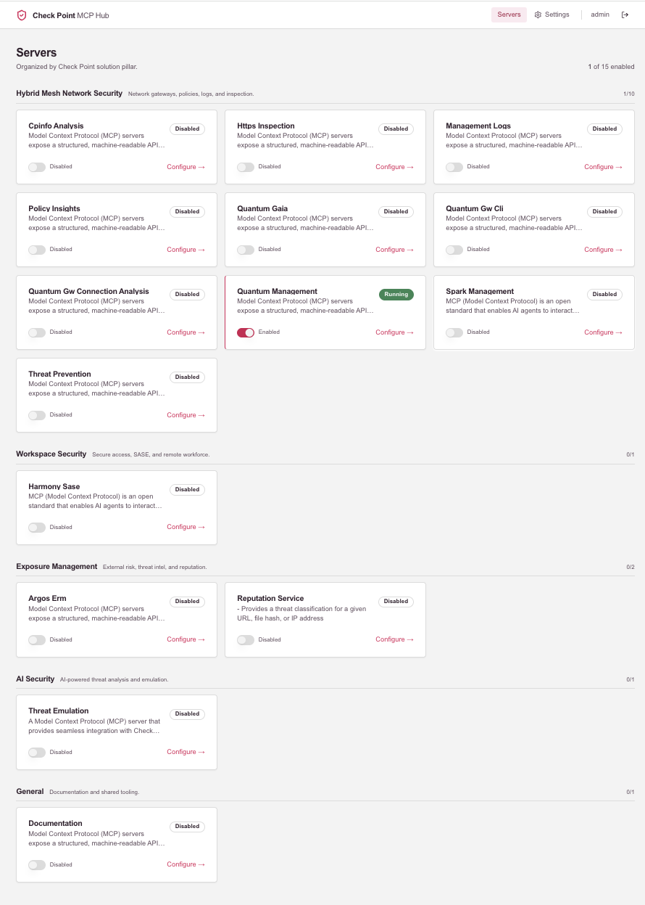
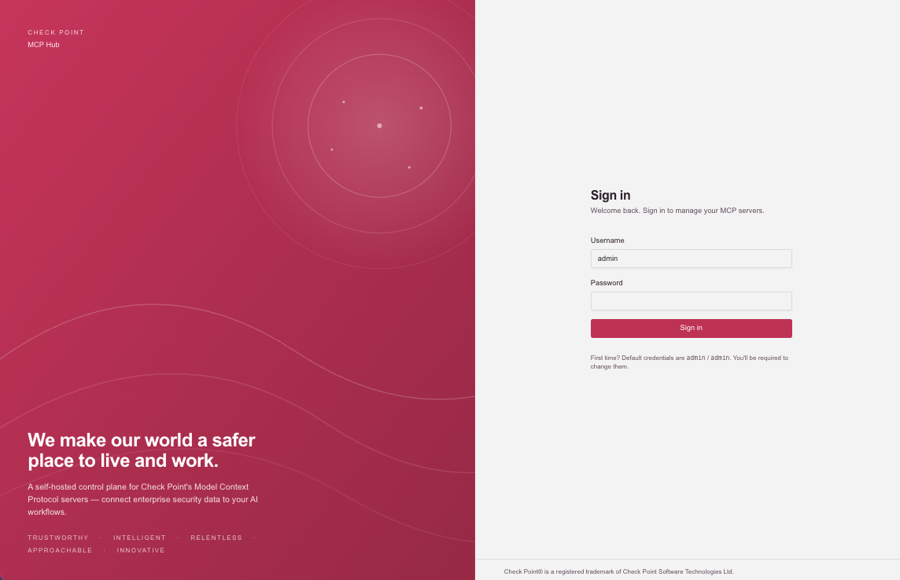
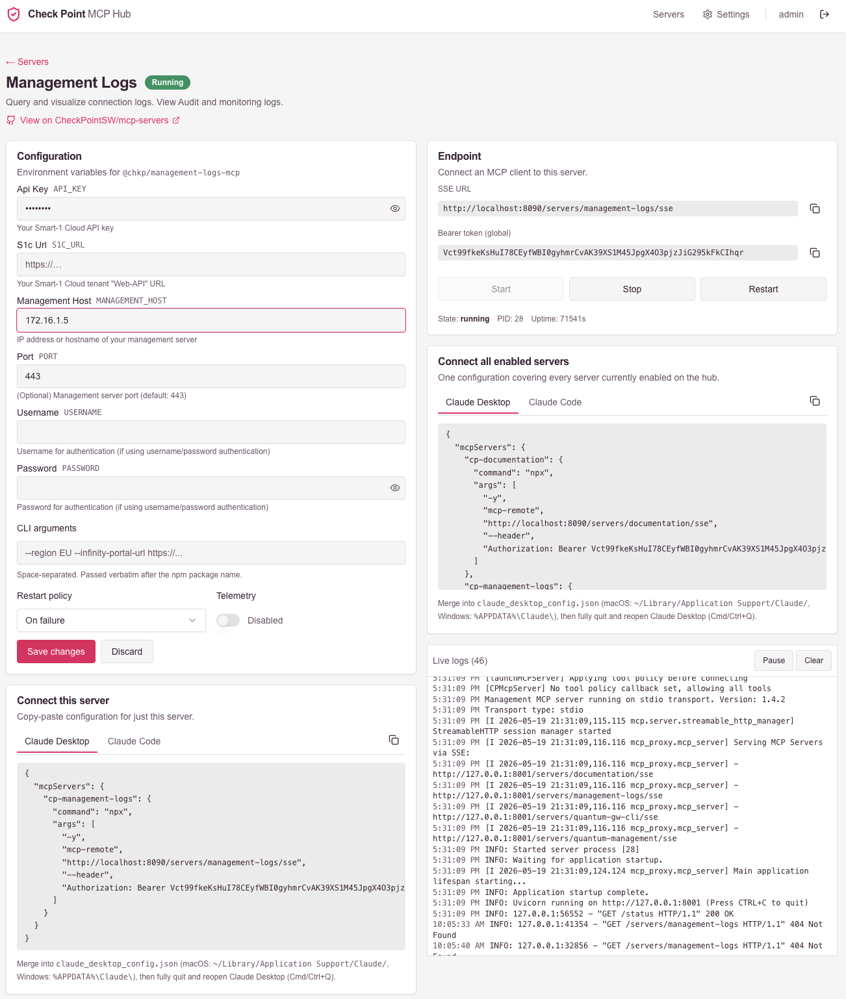
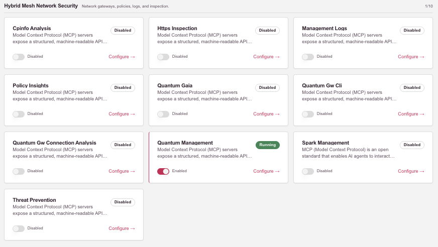
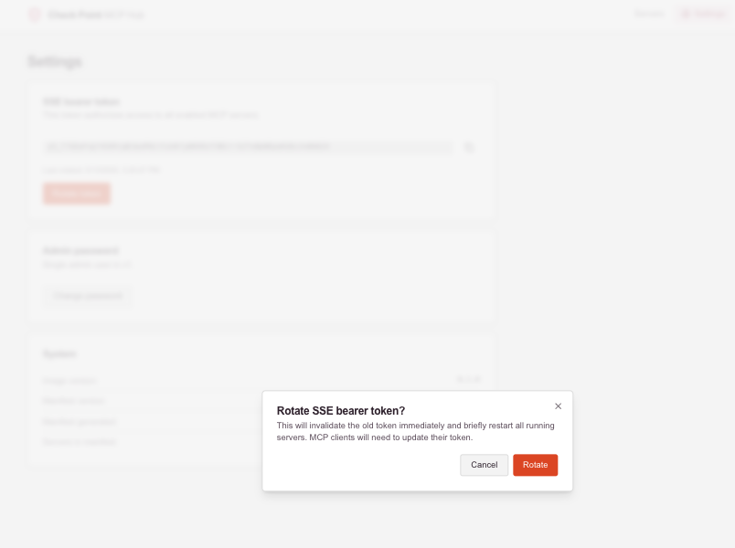

<h1 align="center">Check Point MCP Hub</h1>

<p align="center">
  <b>A self-hosted control plane for Check Point's MCP servers.</b><br>
  Enable, configure, and monitor every <code>@chkp/*-mcp</code> server through a browser — and connect them to Claude, Cursor, or any MCP client over a single endpoint.
</p>

<p align="center">
  <a href="https://hub.docker.com/r/aaronroseio/cp-mcp-hub"></a>
  
  <a href="LICENSE"></a>
</p>

<!-- 📷 SCREENSHOT 1 — Dashboard hero shot (the most impressive view).
     Recommended size: ~1600×900 px, PNG, light mode.
     Save to: docs/images/dashboard.png
-->
<p align="center">
  
</p>

---

## 🚀 Quickstart (3 commands)

You need Docker. That's it.

```bash
# 1. Generate a master encryption key (save this somewhere safe!)
docker run --rm aaronroseio/cp-mcp-hub:latest generate-key
# → prints something like: 4Te6XpFq2j8N9k...long-base64-string...=

# 2. Run the hub (paste the key from step 1)
docker run -d --name cp-mcp-hub \
  -e MASTER_KEY='paste-your-key-here' \
  -v cp-mcp-hub-data:/data \
  -p 8000:8000 \
  aaronroseio/cp-mcp-hub:latest

# 3. Open the UI
open http://localhost:8000     # macOS
# or visit http://localhost:8000 in your browser
```

**First login:** `admin` / `admin` — you'll be required to set a new password (min 12 chars).

> 💡 **Save your `MASTER_KEY` out of band** (password manager, 1Password, etc). Losing it means re-entering every credential.

---

## 📸 What it looks like

<!-- 📷 SCREENSHOT 2 — Login screen with brand hero panel.
     Recommended size: ~1600×1000 px. Captures the Brand Berry hero on the left,
     form on the right. Use a fresh browser window with no devtools.
     Save to: docs/images/login.png
-->
<table>
<tr>
<td width="50%">

<br><sub><b>Login</b> — Brand-aligned, single-user admin in v1.</sub>
</td>
<td width="50%">
<!-- 📷 SCREENSHOT 3 — Server detail page showing config form, SSE endpoint card, and live log viewer.
     Best taken with `documentation` or `quantum-management` enabled and running.
     Save to: docs/images/server-detail.png
-->

<br><sub><b>Server detail</b> — Configure env vars, copy the SSE endpoint, watch logs live.</sub>
</td>
</tr>
<tr>
<td width="50%">
<!-- 📷 SCREENSHOT 4 — Dashboard zoomed in showing one pillar group with cards.
     Optional close-up; can crop from screenshot 1 instead.
     Save to: docs/images/pillar-group.png
-->

<br><sub><b>Pillar grouping</b> — Organized by Check Point's four solution pillars.</sub>
</td>
<td width="50%">
<!-- 📷 SCREENSHOT 5 — Settings page with the rotate-token confirmation dialog open.
     Save to: docs/images/settings.png
-->

<br><sub><b>Settings</b> — Rotate the SSE bearer, change admin password, see system info.</sub>
</td>
</tr>
</table>

---

## 🔌 Connecting an MCP client

Once you've enabled a server in the UI, copy the **SSE URL** and the **Bearer token** from its detail page.

### Claude Desktop

Edit `~/Library/Application Support/Claude/claude_desktop_config.json` (macOS) and add an entry that bridges through `mcp-remote`:

```json
{
  "mcpServers": {
    "cp-quantum-management": {
      "command": "npx",
      "args": [
        "-y",
        "mcp-remote",
        "http://localhost:8000/servers/quantum-management/sse",
        "--header",
        "Authorization: Bearer YOUR_TOKEN_HERE"
      ]
    }
  }
}
```

Quit Claude Desktop fully (Cmd+Q) and reopen. The tools appear in the chat's tool picker.

### Claude Code

One command:

```bash
claude mcp add cp-quantum-management \
  --transport sse \
  --header "Authorization: Bearer YOUR_TOKEN_HERE" \
  http://localhost:8000/servers/quantum-management/sse
```

Confirm with `claude mcp list`.

### Quick smoke test (curl)

```bash
curl -N -H "Authorization: Bearer YOUR_TOKEN" -H "Accept: text/event-stream" \
  http://localhost:8000/servers/quantum-management/sse
```

You should see SSE handshake data within a second or two. Ctrl+C to stop.

---

## 🐳 Other ways to run

### Docker Compose

A starter compose file is included — see [`docker-compose.example.yml`](docker-compose.example.yml). Copy it, paste your `MASTER_KEY`, then:

```bash
docker compose -f docker-compose.example.yml up -d
```

### Behind a reverse proxy (Caddy, Traefik, Tailscale Serve, …)

The UI has **no built-in TLS or extra auth** beyond the single admin user. **Do not expose port 8000 directly to the internet.** Put it behind a proxy that terminates TLS and adds another auth layer.

If your proxy serves the hub at a public URL (e.g. `https://mcp.example.com`), set `EXTERNAL_BASE_URL` so the UI displays the right SSE URLs in copy-to-clipboard fields:

```bash
docker run -d --name cp-mcp-hub \
  -e MASTER_KEY='...' \
  -e EXTERNAL_BASE_URL='https://mcp.example.com' \
  -v cp-mcp-hub-data:/data \
  -p 8000:8000 \
  aaronroseio/cp-mcp-hub:latest
```

---

## ⚙️ Configuration reference

| Variable             | Required | Default                                          | Purpose |
|----------------------|----------|--------------------------------------------------|---------|
| `MASTER_KEY`         | **yes**  | —                                                | 32-byte url-safe base64 Fernet key. Container exits if missing or invalid. |
| `SECRET_KEY`         | no       | derived from `MASTER_KEY`                        | Signs the session cookie. |
| `DATABASE_URL`       | no       | `sqlite+aiosqlite:////data/cp-mcp-hub.db`        | SQLite path (rarely changed). |
| `HOST`               | no       | `0.0.0.0`                                        | Bind address. |
| `PORT`               | no       | `8000`                                           | Public HTTP port. |
| `MCP_PROXY_PORT`     | no       | `8001`                                           | Internal mcp-proxy port (loopback). |
| `DATA_DIR`           | no       | `/data`                                          | DB + per-server log files live here. |
| `MANIFEST_PATH`      | no       | `/app/server_definitions.json`                   | Manifest of all known `@chkp/*-mcp` servers. |
| `EXTERNAL_BASE_URL`  | no       | (empty)                                          | If set, the UI displays this in SSE URL copy fields. e.g. `https://mcp.example.com`. |
| `LOG_LEVEL`          | no       | `INFO`                                           | Standard Python log level. |

---

## 🔒 Security model

- **`MASTER_KEY` is the only secret that unlocks the database.** Lose it, and the encrypted credentials are useless. Back it up out of band.
- All saved credentials (API keys, passwords, tokens marked `secret` in the manifest) are encrypted at rest with **Fernet** (AES-128-CBC + HMAC-SHA256).
- The web UI is **single-user (`admin`) in v1**. Don't expose it to the internet without a reverse proxy enforcing TLS and additional auth.
- The SSE bearer token is **global** — it authorizes access to every enabled MCP server. Rotate it from **Settings** whenever you suspect compromise.
- The plaintext form value is **never** returned by the API — the UI displays `********` for stored secrets and preserves them on save when left unchanged.
- Telemetry to Check Point is **off by default** for every server (`TELEMETRY_DISABLED=true` is injected into the child env). Opt in per-server in the UI.
- The container runs as a non-root user (`cpmcp`, UID 10001). `docker history` does not contain plaintext secrets.

---

## 🗄️ Backup, restore, upgrade

**Backup**: snapshot the data volume. You also need to keep `MASTER_KEY` somewhere safe — the volume alone is useless without it.

```bash
docker run --rm -v cp-mcp-hub-data:/data -v "$(pwd)":/backup alpine \
  tar czf /backup/cp-mcp-hub-backup-$(date +%F).tar.gz /data
```

**Restore**: untar into a fresh volume, then start the container with the same `MASTER_KEY`.

```bash
docker volume create cp-mcp-hub-data
docker run --rm -v cp-mcp-hub-data:/data -v "$(pwd)":/backup alpine \
  tar xzf /backup/cp-mcp-hub-backup-YYYY-MM-DD.tar.gz -C /
```

**Upgrade**: pull and recreate. State and credentials persist in the volume.

```bash
docker pull aaronroseio/cp-mcp-hub:latest
docker stop cp-mcp-hub && docker rm cp-mcp-hub
# re-run the same `docker run …` command from Quickstart step 2.
```

Want a reproducible build? Use a `:sha-<short>` tag instead of `:latest`.

---

## 🆘 Troubleshooting

| Symptom | Likely cause | Fix |
|---|---|---|
| Container exits immediately with `FATAL: MASTER_KEY env var is required` | Forgot the env var | Re-run with `-e MASTER_KEY='...'` |
| Container exits with `MASTER_KEY is not a valid 32-byte url-safe base64 Fernet key` | Pasted truncated or bad key | Regenerate: `docker run --rm aaronroseio/cp-mcp-hub:latest generate-key` |
| Health check fails / `http://localhost:8000` shows nothing | Port 8000 already in use, or container still booting | Change port mapping (e.g. `-p 8080:8000`), or wait ~10s and re-check |
| Server card stuck on `Starting` | The `@chkp/*-mcp` package failed to launch | `docker logs cp-mcp-hub | grep -i error` — usually a missing/wrong env var on the server's config page |
| SSE endpoint returns 401 | Wrong / old bearer token | Re-copy from **Settings** page. Tokens are rotated by the rotate button. |
| SSE endpoint returns 404 | Server is not enabled, or just got disabled | Toggle it on from the dashboard. |
| `must_change_password: true` keeps redirecting | First login state | Set a new password (≥ 12 chars). This is required only once. |

For more verbose logs: `docker run … -e LOG_LEVEL=DEBUG …`

---

## 🏗️ Architecture (brief)

```
public :8000 ──► FastAPI (PID 1) ─┬─ /              SPA (React)
                                  ├─ /api/*         management API
                                  └─ /servers/*  ──► mcp-proxy :8001 (loopback)
                                                       ├─ @chkp/quantum-management-mcp  (Node, stdio)
                                                       ├─ @chkp/documentation-mcp       (Node, stdio)
                                                       └─ … up to 15 enabled servers
```

- **FastAPI** is PID 1 and supervises a single `mcp-proxy` child via `asyncio.subprocess`.
- **mcp-proxy** in named-servers mode fans incoming SSE requests out to per-server Node subprocesses.
- **SQLite** at `/data/cp-mcp-hub.db` holds server state, encrypted credentials, the admin user, and the bearer token.
- All `@chkp/*-mcp` packages are baked into the image — no network access needed at runtime.

---

## 👩‍💻 Development

```bash
# Backend
cd backend
python -m venv .venv && source .venv/bin/activate
pip install -e ".[dev]"
export MASTER_KEY=$(python -c "from cryptography.fernet import Fernet; print(Fernet.generate_key().decode())")
export DATA_DIR=./data && mkdir -p ./data
alembic upgrade head
uvicorn app.main:app --factory --reload --port 8000
```

```bash
# Frontend (separate shell)
cd frontend
npm install
npm run dev    # proxies /api and /servers to localhost:8000
```

```bash
# Tests
cd backend && pytest -q
```

### Refresh the server manifest

`server_definitions.json` is generated from the upstream CheckPointSW/mcp-servers repo. CI regenerates this weekly and opens a PR if anything changed.

```bash
python scripts/build_manifest.py
```

### Building the image locally

```bash
docker build -t cp-mcp-hub:dev .
```

Multi-arch builds for `linux/amd64` and `linux/arm64` are published by CI on every push to `main`, every `v*` tag, and weekly.

---

## 📐 Brand & legal

This is **community tooling** for [CheckPointSW/mcp-servers](https://github.com/CheckPointSW/mcp-servers), not an official Check Point product. The UI follows Check Point's published 2026 brand guidelines (colors, typography rules) but does **not** use the Check Point logo, which requires brand-request approval.

Check Point® is a registered trademark of Check Point Software Technologies Ltd.

## 📂 What's out of scope (v1)

Per-server SSE tokens · OIDC/SSO · multi-user · TLS termination inside the container · Prometheus metrics · auto-updating MCP packages in a running container · UI-driven backup/export · hub self-telemetry.

## 📜 License

Licensed under the [Apache License 2.0](LICENSE). See [NOTICE](NOTICE) for third-party attributions.
